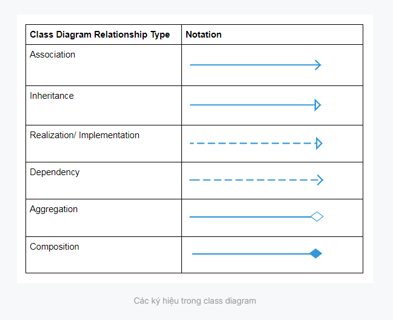

Thanks to efforts killed by: Nhờ vào sự cố gắng của...

To stay away from undesired issue: tránh xa vấn đề không mong muốn 

# Creational Design Patterns:
- Factory Method: Sử dụng các phương thức trừu tượng của một factory thay vì constructor để tạo các đối tượng. -> Cho phép thay đổi hoặc ghi đè các phương thức tạo.
- Abstract Factory: Định nghĩa interface của các factory. Bằng cách thay đổi factory được truyền vào, chúng ta có thể thay đổi nhóm sản phẩm được tạo ra.
- Builder: Định nghĩa các step để build các đối tượng, và thay đổi những gì được tạo ra bằng cách thay đổi trình tự các bước hoặc sử dụng để triển khai builder khác. 
- Singleton: Đảm bảo chỉ có một thể hiện (1 instance) của 1 đối tượng được tạo ra.

# Dive deep into each pattern:

Factory Method:
- 